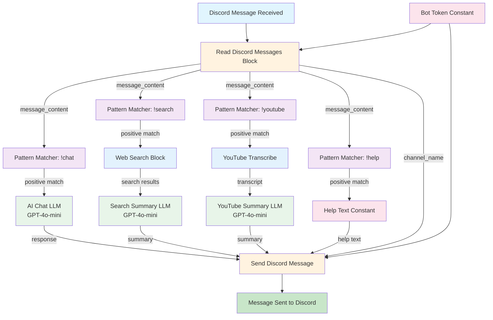
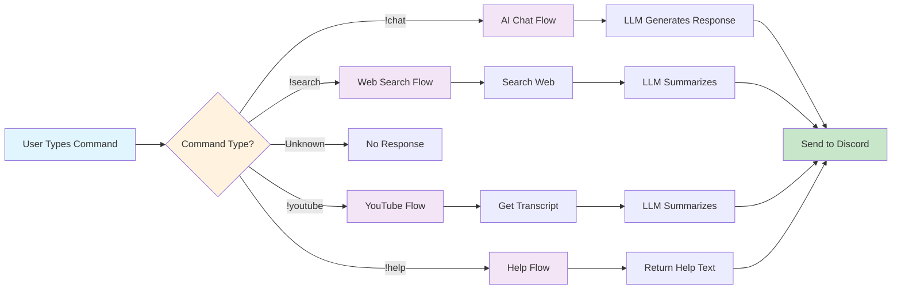
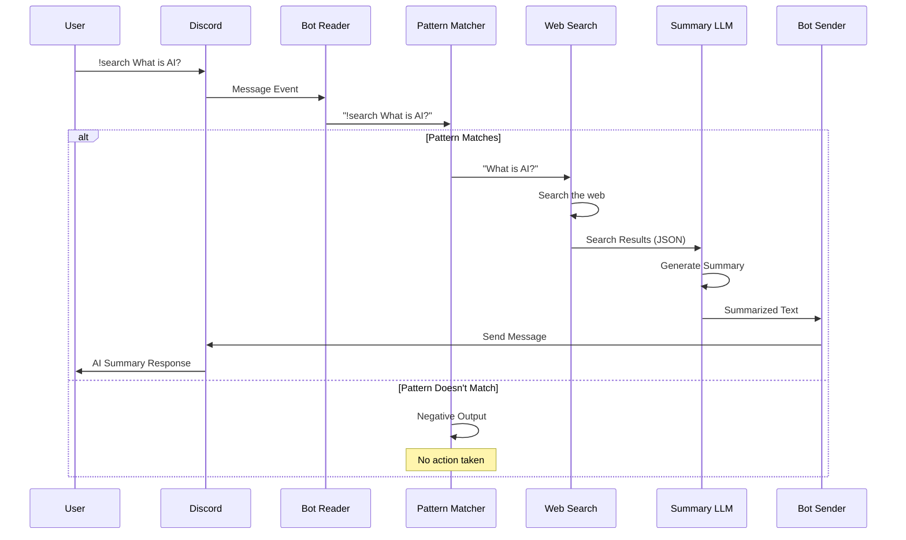
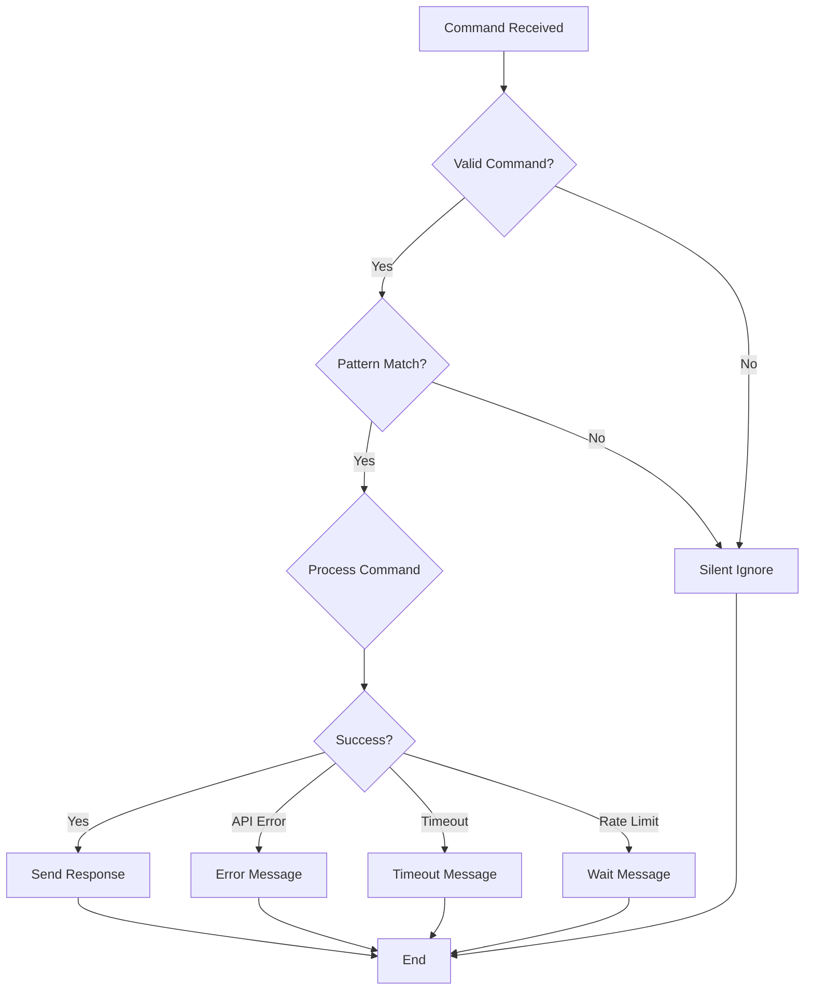
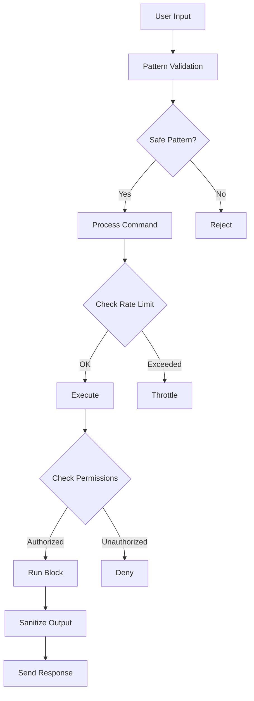

# Smart Discord Assistant Bot - Architecture Diagram

## Bot Flow Visualization



## Command Routing



## Data Flow Example: !search Command



## Block Types Legend

| Block Type | Purpose | Count in Bot |
|------------|---------|--------------|
| 🔵 Input | Read Discord Messages | 1 |
| 🔮 Pattern Matcher | Route commands | 4 |
| 🧠 LLM | AI text generation | 3 |
| 🔍 Web Search | Search internet | 1 |
| 📹 YouTube | Transcribe videos | 1 |
| 📝 Constant | Store bot token/text | 2 |
| 🔴 Output | Send Discord Messages | 1 |
| **Total** | | **13 nodes** |

## Key Features

### Multi-Command Support
The bot uses **parallel pattern matching** to support multiple commands simultaneously. Each pattern matcher independently checks the message, allowing for:
- Fast command detection
- Multiple command types
- Easy addition of new commands
- No command conflicts

### AI Model Configuration
Three separate LLM instances allow for:
- **Chat LLM**: Conversational personality
- **Search LLM**: Focused summarization
- **YouTube LLM**: Video content analysis

Each can use different models or prompts for optimal performance.

### Scalability
The modular architecture supports:
- Adding new command patterns
- Integrating new data sources
- Changing AI models per task
- Independent scaling of components

## Performance Considerations

### Token Usage (Approximate)
These are estimated ranges and actual usage may vary significantly based on content length, complexity, and model:
- **Chat**: ~50-200 tokens per request (varies by message length)
- **Search**: ~300-500 tokens (search results + summary, varies by results)
- **YouTube**: ~500-2000 tokens (transcript + summary, varies by video length)
- **Help**: 0 tokens (static text, no API calls)

### Response Time
- **Chat**: 1-3 seconds
- **Search**: 3-5 seconds (search + summarize)
- **YouTube**: 5-10 seconds (fetch + transcribe + summarize)
- **Help**: <1 second

### Optimization Tips
1. Use `gpt-4o-mini` for cost-effective responses
2. Cache YouTube transcripts
3. Implement rate limiting per user
4. Set max token limits on LLM blocks
5. Use shorter system prompts

## Error Handling



## Adding New Commands

To add a new command (e.g., `!translate`):

1. **Add Pattern Matcher Block**
   ```json
   {
     "block_id": "3146e4fe-2cdd-4f29-bd12-0c9d5bb4deb0",
     "input_default": {
       "pattern": "^!translate\\s+(.+)"
     }
   }
   ```

2. **Add Processing Block** (e.g., Translation LLM)
   ```json
   {
     "block_id": "1f292d4a-41a4-4977-9684-7c8d560b9f91",
     "input_default": {
       "sys_prompt": "Translate the following text to English..."
     }
   }
   ```

3. **Connect Links**
   - Discord Reader → Pattern Matcher
   - Pattern Matcher → Processing Block
   - Processing Block → Discord Sender

4. **Update Help Text** to include new command

## Security Considerations



### Security Checklist
- ✅ Pattern matchers prevent command injection
- ✅ Bot token stored securely
- ✅ API keys managed by platform
- ✅ Input validation via regex
- ✅ Output sanitization by Discord API
- ⚠️ Recommend: Add rate limiting
- ⚠️ Recommend: Add user permission checks
- ⚠️ Recommend: Log command usage

## Deployment Options

### Option 1: Local Development
```
AutoGPT Platform (localhost:8000)
    ↓
Discord Bot Connection
    ↓
Your Discord Server
```

### Option 2: Cloud Hosted
```
AutoGPT Cloud Platform
    ↓
Discord Bot Connection
    ↓
Your Discord Server
```

### Option 3: Self-Hosted Production
```
Docker Container (AutoGPT Platform)
    ↓
Reverse Proxy (nginx)
    ↓
Discord Bot Connection
    ↓
Your Discord Server
```

## Monitoring

Key metrics to track:
- Commands per minute
- Response time per command
- API token usage
- Error rate
- User engagement
- Cost per interaction

## Conclusion

The Smart Discord Assistant Bot demonstrates the power of AutoGPT's block-based architecture. By combining multiple specialized blocks, we create a versatile assistant that can:

1. **Understand** user intent via pattern matching
2. **Process** requests using appropriate tools
3. **Generate** intelligent responses via LLM
4. **Respond** back to users seamlessly

This modular approach allows for easy customization, scaling, and maintenance while keeping the implementation clean and understandable.
